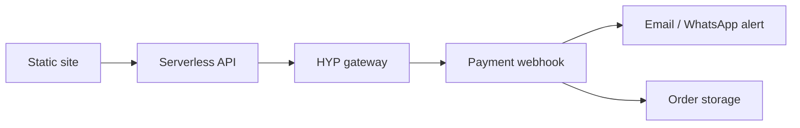

# HYP online payments — future integration

This document outlines how to add **HYP** (or similar Israeli payment gateway) to the static storefront when you are ready to move beyond WhatsApp checkout.

## Current state (Phase 1)

- Catalog + cart in the browser (`localStorage`)
- Checkout opens WhatsApp with a pre-filled order message
- No server, no order database, no payment webhooks
- You are notified only when the customer **sends** the WhatsApp message

## Target state (Phase 2)



## Components to add

### 1. Backend (serverless recommended)

Host on the same platform as the static site:

| Platform | Folder | Notes |
|----------|--------|-------|
| Netlify | `netlify/functions/` | Works with existing `netlify.toml` |
| Vercel | `api/` | Serverless Node or Python |
| Cloudflare | `functions/` | Workers for edge API |

Suggested endpoints:

- `POST /api/checkout` — create HYP payment session from cart JSON
- `POST /api/webhooks/hyp` — receive payment confirmation from HYP
- `GET /api/orders/:id` — optional order status for customer

### 2. Environment variables (never in `js/config.js`)

Store secrets only on the server:

```
HYP_MERCHANT_ID=...
HYP_API_KEY=...
HYP_WEBHOOK_SECRET=...
NOTIFY_EMAIL=orders@example.com
RESEND_API_KEY=...          # or SendGrid, etc.
```

### 3. Frontend changes

In [`js/app.js`](../js/app.js):

- Add a **"תשלום מאובטח"** button next to the WhatsApp checkout
- POST cart contents to `/api/checkout`
- Redirect customer to HYP hosted payment page
- Show success/failure page after return URL

Keep WhatsApp checkout as a fallback for phone orders.

### 4. Webhooks & notifications

When HYP confirms payment:

1. Verify webhook signature
2. Save order (Supabase, Airtable, Google Sheets, or simple JSON store)
3. Send notification to store owner:
   - **Email** via Resend / SendGrid (recommended)
   - **WhatsApp Business API** (more setup)
   - **SMS** via Twilio / local provider

This is the only way to get reliable **"someone paid"** alerts without the customer manually messaging you.

### 5. Order model (minimal)

```json
{
  "id": "ord_abc123",
  "createdAt": "2026-06-30T12:00:00Z",
  "status": "paid",
  "customer": { "name": "", "phone": "", "email": "" },
  "items": [{ "productId": "...", "name": "...", "qty": 2, "price": 45 }],
  "total": 90,
  "paymentRef": "hyp_tx_..."
}
```

### 6. Security checklist

- Validate cart prices server-side (never trust client totals)
- Rate-limit checkout endpoint
- HTTPS only
- Verify HYP webhook signatures
- Do not log full card data (HYP handles PCI)

## Pragmatic rollout

1. **Now:** Deploy WhatsApp checkout (Phase 1) — see [`README.md`](../README.md)
2. **When HYP account is ready:** Add one serverless function + webhook + email alert
3. **Later:** Order history dashboard, inventory sync, receipt emails to customers

## Alternative: Wix checkout

Until HYP is integrated, you can send paying customers to the Wix store via `wixStoreUrl` in [`js/config.js`](../js/config.js). Wix handles payments and notifies you through its dashboard.

## Related files

- [`js/config.js`](../js/config.js) — public store contact (no secrets)
- [`netlify.toml`](../netlify.toml) — static hosting config
- [`scripts/smoke-test.py`](../scripts/smoke-test.py) — pre-deploy checks
