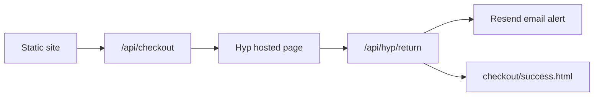

# Hyp Pay integration (Phase 2)

This document outlines how to add **Hyp Pay** (formerly referenced
HYP / YaadPay) to the static storefront when moving beyond WhatsApp checkout.

**Docs:** https://developers.hyp.co.il/

## Current state (Phase 1)

- Catalog + cart in the browser (`localStorage`)
- Checkout opens WhatsApp with a pre-filled order message
- **תשלום מאובטח** button is wired to `/api/checkout` (returns friendly message until Hyp env vars are set)

## Hyp Pay flow (redirect-based, not webhooks)

Hyp uses a **hosted payment page**. After payment, the customer is redirected back to your site with query parameters including a MAC for verification.

## Scaffolded files (ready for credentials)

| File | Purpose |
|------|---------|
| [`api/checkout.js`](../api/checkout.js) | Validate cart, create Hyp payment page |
| [`api/hyp/return.js`](../api/hyp/return.js) | Verify MAC, send email, redirect |
| [`lib/catalog.js`](../lib/catalog.js) | Server-side price validation |
| [`lib/hyp.js`](../lib/hyp.js) | Hyp API client |
| [`lib/notify.js`](../lib/notify.js) | Resend order emails |
| [`.env.example`](../.env.example) | Required environment variables |
| [`docs/HYP-PREP-CHECKLIST.md`](HYP-PREP-CHECKLIST.md) | Pre-integration checklist |

## Environment variables (Vercel only — never in `js/config.js`)

Copy from [`.env.example`](../.env.example). Key values from Hyp:

- `HYP_API_URL`, `HYP_API_USER`, `HYP_API_PASSWORD`
- `HYP_TERMINAL_NUMBER`, `HYP_MID`, `HYP_MAC_KEY`
- `SITE_URL`, `RESEND_API_KEY`, `NOTIFY_EMAIL`

## Frontend

In [`js/app.js`](../js/app.js):

- **תשלום מאובטח** — POST cart to `/api/checkout`, redirect to Hyp
- **שליחת הזמנה בוואטסאפ** — kept as fallback for phone orders

## Security checklist

- Validate cart prices server-side (never trust client totals) — done in `lib/catalog.js`
- HTTPS only
- Verify Hyp MAC on return redirect — refine algorithm per Hyp docs in `lib/hyp.js`
- Do not log card data (Hyp handles PCI)

## Rollout

1. **Now:** WhatsApp checkout live on Vercel
2. **When Hyp account is ready:** Fill Vercel env vars from [HYP-PREP-CHECKLIST.md](HYP-PREP-CHECKLIST.md) and redeploy
3. **Later:** Order database, customer receipt emails, inventory sync

## Alternative: Wix checkout

Until Hyp is live, paying customers can use the Wix store via `wixStoreUrl` in [`js/config.js`](../js/config.js).
